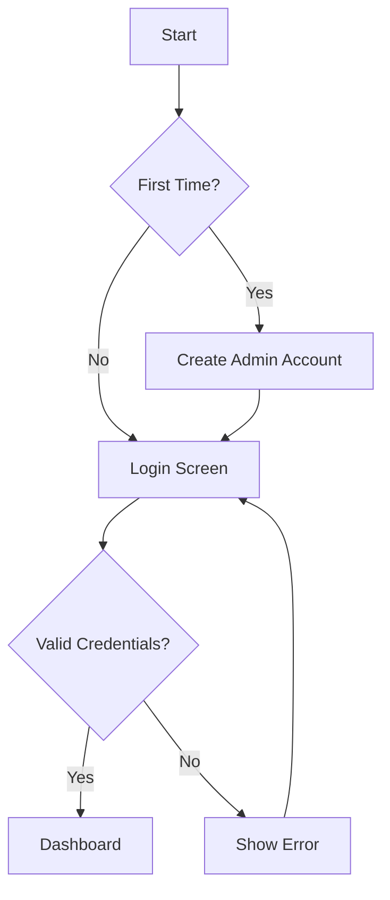
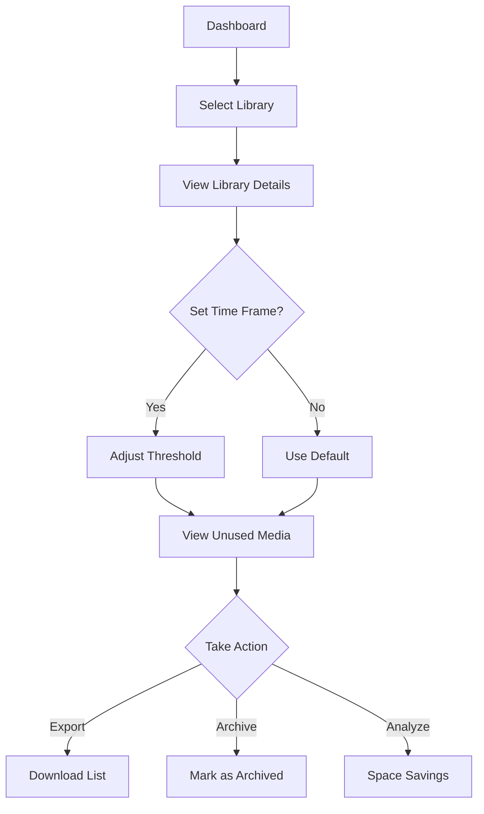
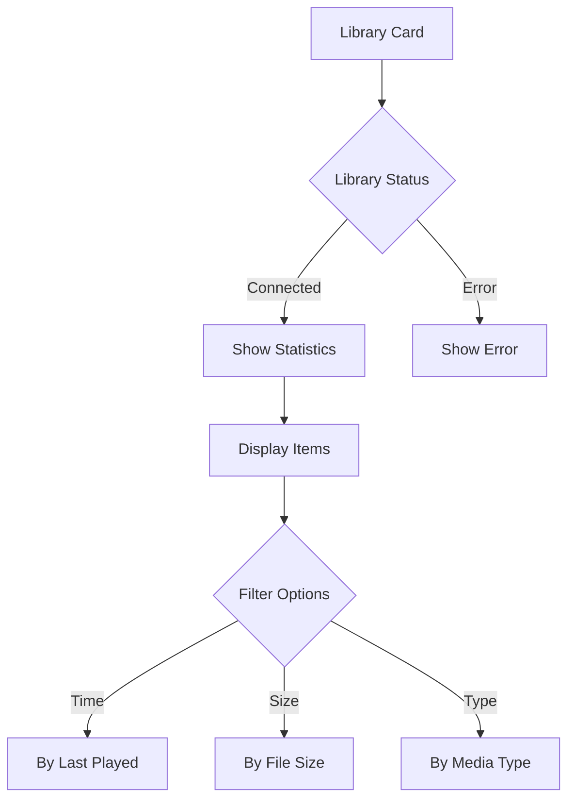
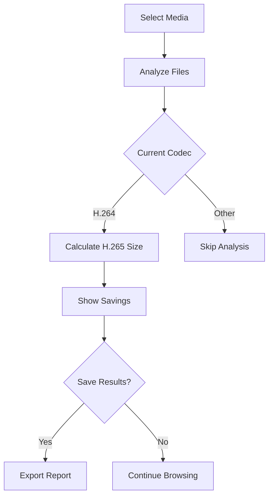
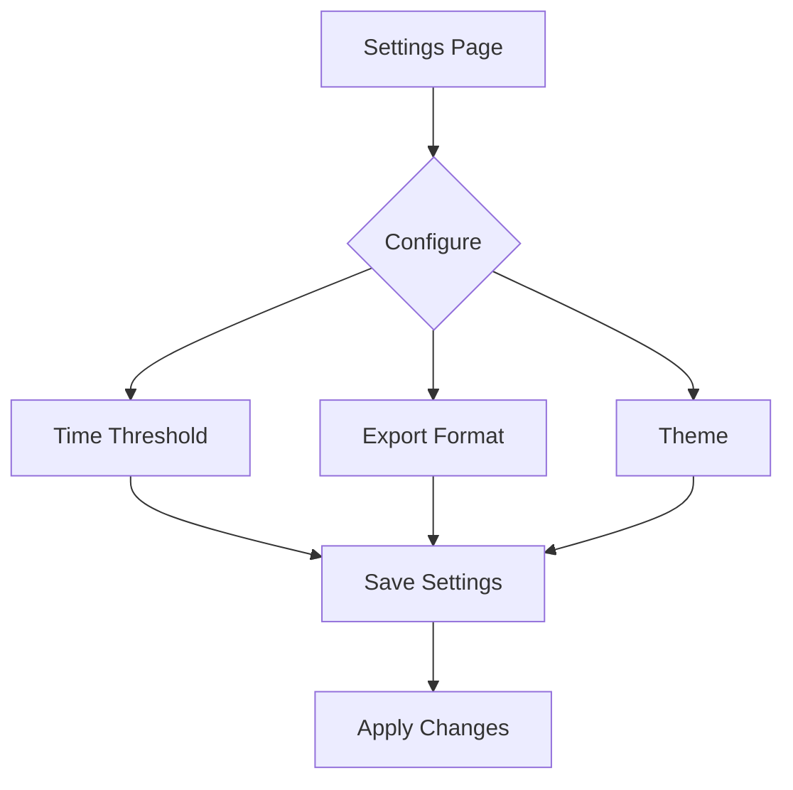
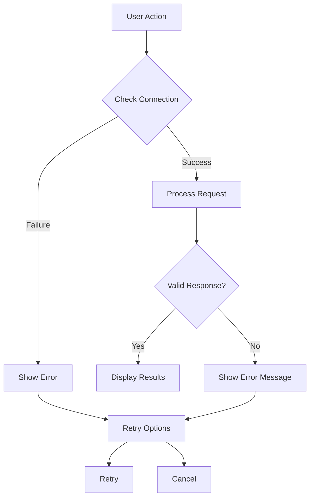

# User Flow Documentation

## Authentication Flow

## Main User Journey

## Library Management Flow

## Space Analysis Flow

## Settings Management

## Error Handling Flow

## Component Interactions

### Dashboard View

1. **Initial Load**

   - Check authentication
   - Load library list
   - Display statistics

2. **Library Selection**

   - Show library details
   - Load unused media
   - Calculate statistics

3. **Media Actions**
   - Export functionality
   - Archive options
   - Space analysis

### Settings Management

1. **Configuration**

   - Time threshold setting
   - Export format selection
   - Theme customization

2. **Data Management**
   - Cache clearing
   - Archive management
   - Export history

## Edge Cases

1. **Offline Mode**

   - Cache recent data
   - Show offline indicator
   - Queue changes

2. **Large Libraries**

   - Pagination
   - Lazy loading
   - Progressive rendering

3. **Error States**
   - Connection issues
   - Invalid data
   - Permission errors
